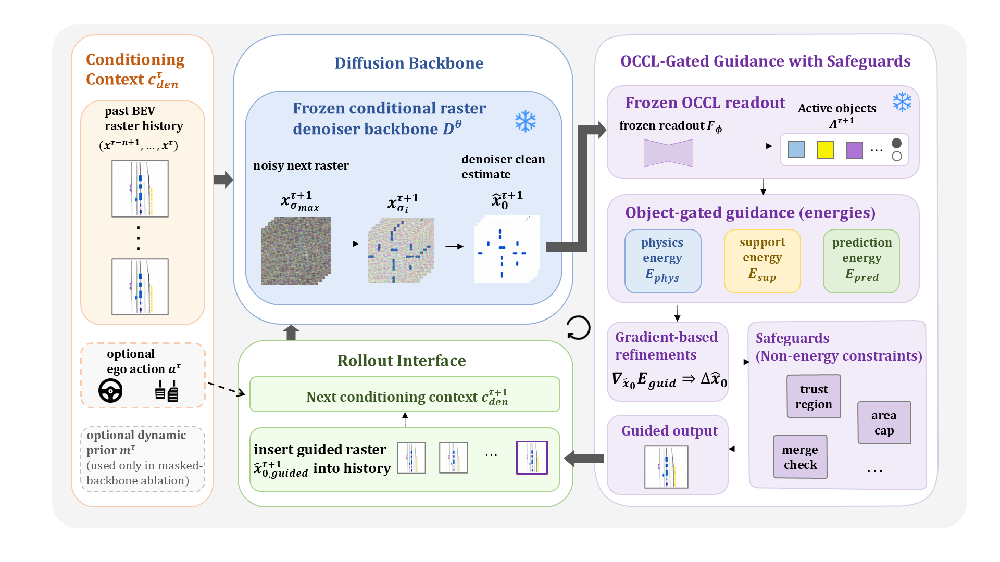
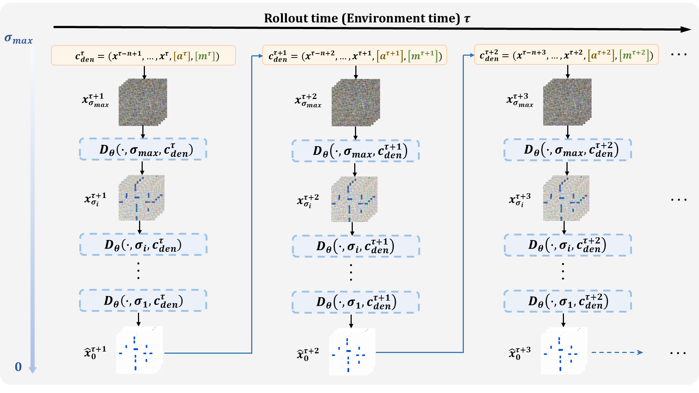
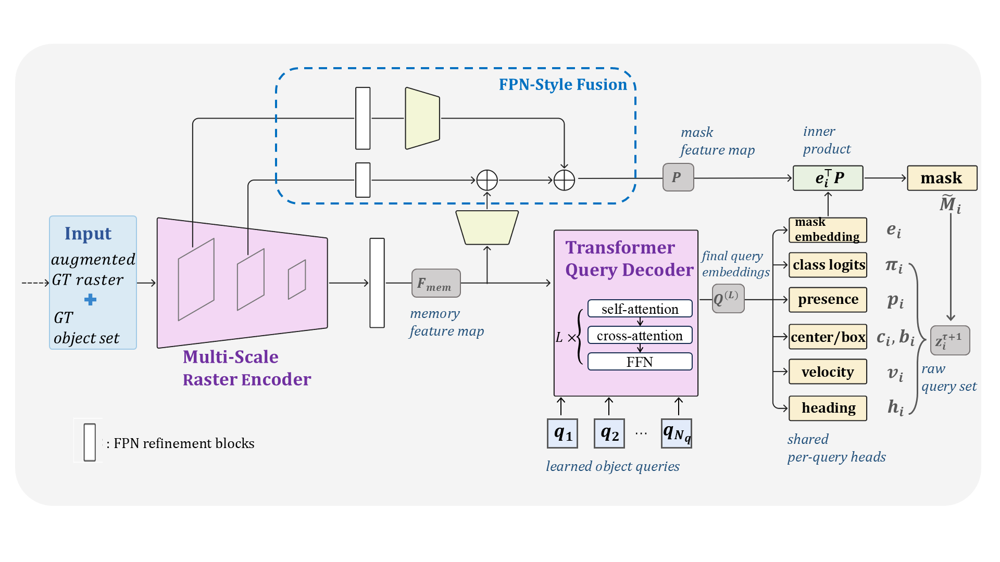
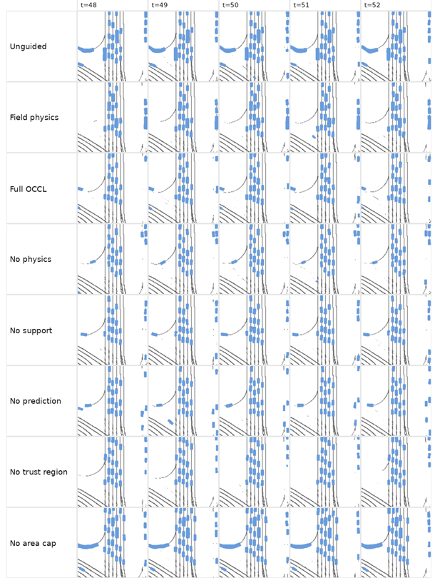
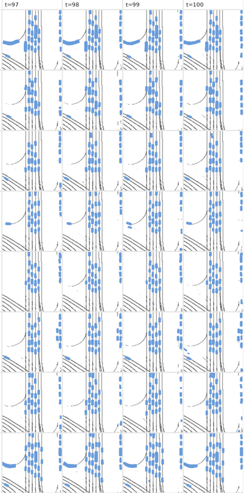
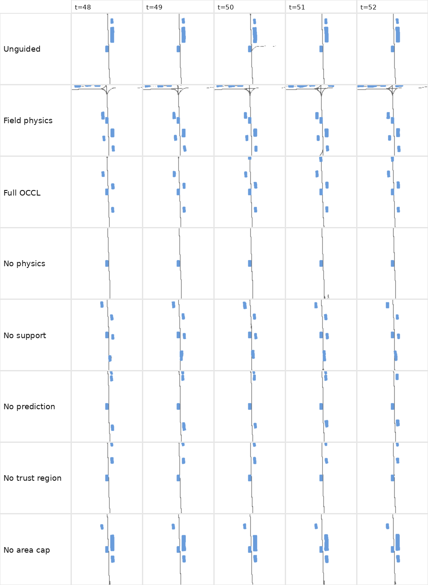
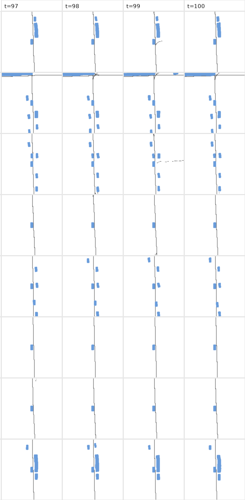
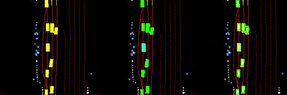

# Physics-Guided-World-Model


> *Inference-Time Physics Guidance for Latent BEV Diffusion World Models with an Object-Centric Completion Layer.* \
> **Code release:** Coming soon.

---

## Overview

We propose an inference-time physics-guided framework for latent BEV diffusion world models. The framework introduces an **Object-Centric Completion Layer (OCCL)** and an **inference-time physics-guided sampling strategy** to improve object consistency and physical plausibility during long-horizon BEV rollout generation.

The system adopts **SLEDGE** for BEV scene representation and **DIAMOND** as the frozen diffusion world-model backbone.

<p align="center">

</p>

---

## Main Contributions

- An **Object-Centric Completion Layer (OCCL)** that recovers structured object states from generated BEV rasters.
- An **inference-time physics-guided sampling framework** that improves physical consistency without retraining the diffusion backbone.
- Object-aware guidance objectives targeting disappearance, merging, off-lane motion, collision, and temporal inconsistency.
- Evaluation of long-horizon BEV rollouts on the **nuPlan** benchmark.

---

## Motivation

Diffusion-based world models have recently demonstrated impressive generative capability for autonomous driving. However, purely data-driven rollouts may exhibit:

- object disappearance and flickering,
- object merging and raster smearing,
- physically inconsistent motion,
- off-lane or overlapping agent states,
- error accumulation over long horizons.

This project investigates whether **object-centric reasoning** and **physics-informed inference-time guidance** can improve the physical realism of generated BEV scenes without modifying the pretrained diffusion model.

---

## Method

Our framework consists of three major components.

### 1. BEV Scene Representation

We adapt the preprocessing pipeline introduced in **SLEDGE** to convert raw nuPlan scenes into a compact 12-channel semantic BEV representation. The channels encode lane geometry, dynamic agents, static objects, and traffic-light states.

### 2. Frozen Diffusion Backbone

We use **DIAMOND** as the pretrained diffusion world-model backbone. It autoregressively predicts future BEV states from a short history of past observations. The backbone remains frozen throughout the proposed method.

<p align="center">

</p>


### 3. Object-Centric Completion Layer (OCCL)

OCCL converts generated raster predictions into structured object-level representations. It estimates object presence, position, extent, velocity, heading, and instance masks, providing differentiable object states for downstream physical guidance.

<p align="center">

</p>

### 4. Physics-Guided Sampling

During diffusion sampling, OCCL is applied to the clean scene estimate to recover object-level states. Differentiable physical objectives are then used to guide the sampling trajectory without updating the frozen diffusion model.

The guidance targets:

- lane alignment,
- object persistence,
- collision and overlap reduction,
- temporal motion consistency,
- physically plausible object geometry.

---

## Qualitative Results
The proposed framework improves several aspects of generated rollouts, including object persistence, connected-component consistency, lane alignment, and temporal motion consistency, compared with the baseline **DIAMOND** model.

### Ablation Study

The following examples compare the complete OCCL framework with the unguided baseline, field-level physics guidance, and component-level ablations at intermediate and long rollout horizons.

<h3>Episode 88</h3>

<table>
  <tr>
    <td align="center" width="50%">
      <b>Intermediate Rollout</b><br>
      <sub>Frames 48–52</sub>
    </td>
    <td align="center" width="50%">
      <b>Long-Horizon Rollout</b><br>
      <sub>Frames 97–100</sub>
    </td>
  </tr>
  <tr>
    <td align="center">
      
    </td>
    <td align="center">
      
    </td>
  </tr>
</table>

<h3>Episode 431</h3>

<table>
  <tr>
    <td align="center" width="50%">
      <b>Intermediate Rollout</b><br>
      <sub>Frames 48–52</sub>
    </td>
    <td align="center" width="50%">
      <b>Long-Horizon Rollout</b><br>
      <sub>Frames 97–100</sub>
    </td>
  </tr>
  <tr>
    <td align="center">
      
    </td>
    <td align="center">
      
    </td>
  </tr>
</table>

The complete OCCL configuration generally preserves more coherent object states across longer rollout horizons, while the component-level ablations illustrate the roles of physical guidance, temporal support, prediction, trust-region control, and area regularization.

### Selected Episodes

<table>
  <tr>
    <td align="center" width="33%">
      <b>Scene Transition</b>
    </td>
    <td align="center" width="33%">
      <b>Urban Intersection</b>
    </td>
    <td align="center" width="33%">
      <b>Highway</b>
    </td>
  </tr>
  <tr>
    <td align="center">
      
    </td>
    <td align="center">
      
    </td>
    <td align="center">
      
    </td>
  </tr>
</table>

---

## Installation

```bash
git clone https://github.com/<yourname>/physics-guided-bev-world-model.git

cd physics-guided-bev-world-model

conda create -n pgwm python=3.10

conda activate pgwm

pip install -r requirements.txt
```

---

## Dataset

Experiments are conducted on the **nuPlan** dataset. We adapt the SLEDGE preprocessing pipeline to generate 12-channel semantic BEV sequences for training and evaluation.

---

## Repository Structure

```text
.
├── assets/                  # figures used in README
├── configs/                 # experiment configurations
├── datasets/                # dataset preprocessing
├── models/                  # diffusion backbone
├── occl/                    # Object-Centric Completion Layer
├── guidance/                # physics-guided sampling
├── evaluation/              # evaluation scripts
├── utils/
└── README.md
```
---

## Built Upon

This project builds upon the following excellent open-source projects:

- **SLEDGE** — BEV scene representation for autonomous driving.
  Repository: https://github.com/autonomousvision/sledge

- **DIAMOND** — Diffusion World Model for autonomous driving.
  Repository: https://github.com/eloialonso/diamond

Our contributions focus on:

- Object-Centric Completion Layer (OCCL)
- Physics-guided inference-time optimization

---

## Citation

---

## Contact
